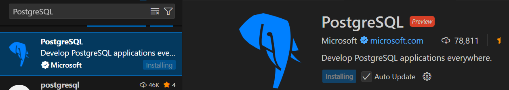
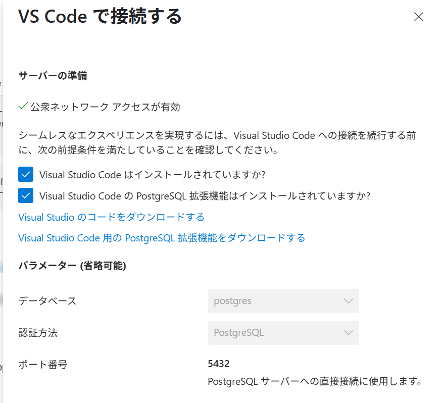

### 前提
VSCodeにPostgreSQL拡張機能をインストールしておくこと。



### データベースの作成とデータ投入
追加ボタンから「todos」データベースを作成


### VSCodeからの接続
Azure Portalから接続




VSCode側の新規タブが開くので、PostgreSQLのパスワードを入力して接続


PostgreSQLの拡張機能から、作成したデータベースを確認
todos データベース を右クリックして New Query を選択


テストデータのdue_dateを当日から前後の日付にして、SQLを実行
```sql
CREATE TABLE todos (
  id UUID PRIMARY KEY DEFAULT gen_random_uuid(),
  title TEXT NOT NULL,
  description TEXT,
  created_at TIMESTAMP DEFAULT CURRENT_TIMESTAMP,
  updated_at TIMESTAMP DEFAULT CURRENT_TIMESTAMP,
  due_date TIMESTAMPTZ, -- タイムゾーン付きタイムスタンプに変更
  status TEXT CHECK (status IN ('Not Started', 'In Progress', 'Completed')) NOT NULL
);

-- テストデータの挿入
INSERT INTO todos (title, description, due_date, status) VALUES
('Azureコンテナサービスの基本を学ぶ', 'UdemyコースでAzureコンテナサービスの基本を学習する', '2025-06-07T00:00:00.000Z', 'Not Started'),
('Dockerの基礎を復習する', 'Dockerの基本的なコマンドと概念を復習する', '2025-06-08T00:00:00.000Z', 'In Progress'),
('Azure Container Appsのデプロイを試す', 'Azure Container Appsのデプロイ方法を学ぶ', '2025-06-09T00:00:00.000Z', 'Not Started'),
('GitHub Actionsを継続的デプロイ', 'GitHub Actionsを使ってアプリを継続的にデプロイする', '2025-06-10T00:00:00.000Z', 'Not Started');
```

実行結果を確認。新しいクエリとして全データ取得するSQLを実行
```sql
SELECT
  id,
  title,
  description,
  created_at,
  updated_at,
  due_date,
  status
FROM
  todos;
```