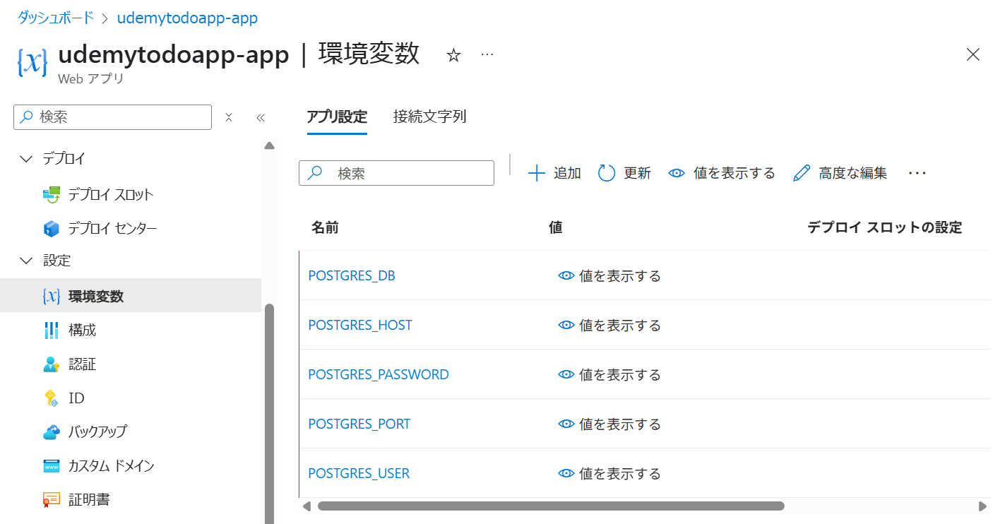
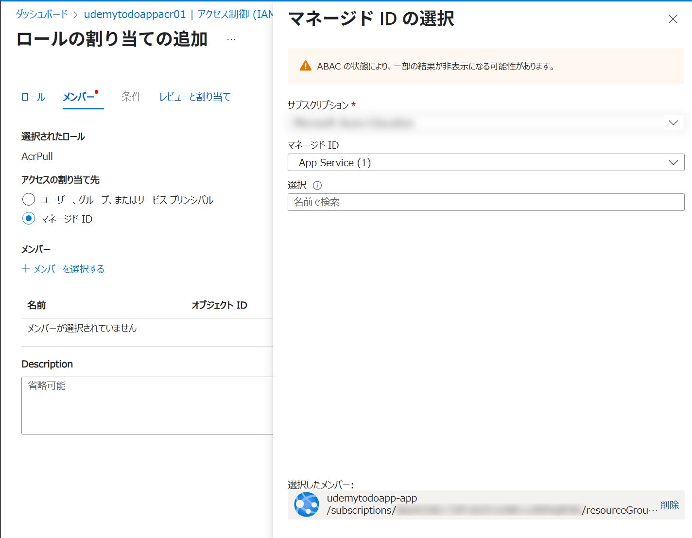
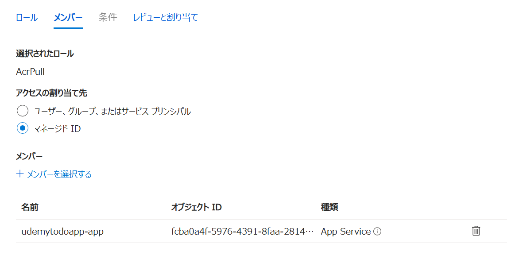
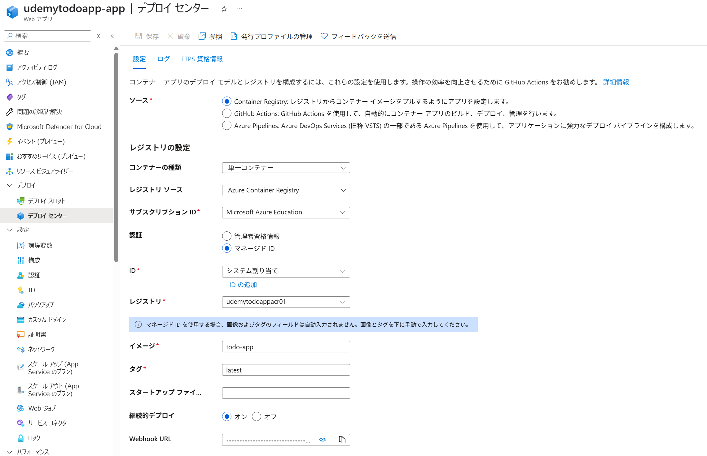
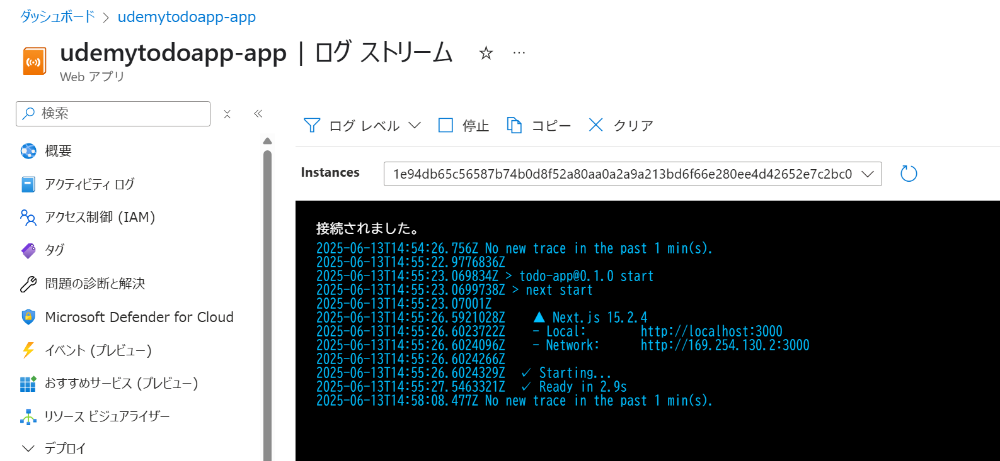

## 環境変数の設定


```json
[
  {
    "name": "POSTGRES_DB",
    "value": "todos",
    "slotSetting": false
  },
  {
    "name": "POSTGRES_HOST",
    "value": "udemytodoapp-pg.postgres.database.azure.com",
    "slotSetting": false
  },
  {
    "name": "POSTGRES_PASSWORD",
    "value": "パスワード",
    "slotSetting": false
  },
  {
    "name": "POSTGRES_PORT",
    "value": "5432",
    "slotSetting": false
  },
  {
    "name": "POSTGRES_USER",
    "value": "pgadmin",
    "slotSetting": false
  }
]
```



## 診断設定

## App ServiceのマネージドIDにACRへのアクセス権を付与
AppServiceのマネージドIDをオンにする


ACRへの権限付与







```bash
az webapp config container set `
  --name udemytodoapp-app `
  --resource-group rg-todo `
  --container-image-name udemytodoappacr01.azurecr.io/todo-app:latest
```

Portalで継続的デプロイをONに

AzurePortalで確認


デプロイログの確認


```bash
az webapp config appsettings set --resource-group rg-todo --name udemytodoapp-app --settings TEST="TEST"
```

