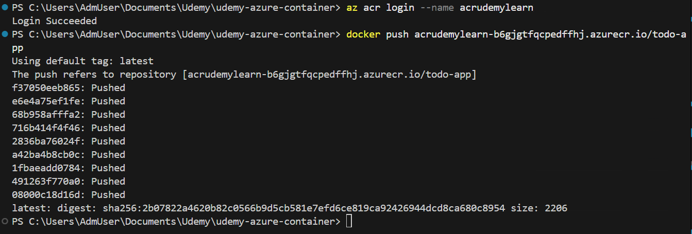

# (手動)コンテナのPush

```bash
docker-compose build
docker tag todo-app udemytodoappacr01.azurecr.io/todo-app:latest
```

```bash
az login
az acr login --name udemytodoappacr01
docker push udemytodoappacr01.azurecr.io/todo-app:latest
```




## Notify-service Container

```bash
docker tag notify-service udemytodoappacr01.azurecr.io/notify-service:latest
az acr login --name udemytodoappacr01
docker push udemytodoappacr01.azurecr.io/notify-service:latest
```


