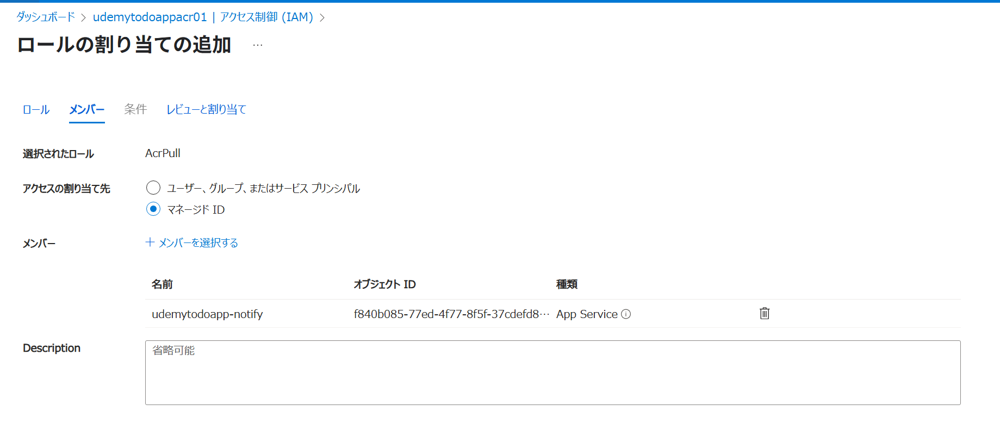

## 環境変数の設定

```json
[
  {
    "name": "POSTGRES_DB",
    "value": "todos",
    "slotSetting": false
  },
  {
    "name": "POSTGRES_HOST",
    "value": "udemytodoapp-pg.postgres.database.azure.com",
    "slotSetting": false
  },
  {
    "name": "POSTGRES_PASSWORD",
    "value": "パスワード",
    "slotSetting": false
  },
  {
    "name": "POSTGRES_PORT",
    "value": "5432",
    "slotSetting": false
  },
  {
    "name": "POSTGRES_USER",
    "value": "pgadmin",
    "slotSetting": false
  },
  {
    "name": "POSTGRES_SSLMODE",
    "value": "require",
    "slotSetting": false
  },
  {
    "name": "SENDER_EMAIL",
    "value": "nomhiro1204@gmail.com",
    "slotSetting": false
  },
  {
    "name": "EMAIL_PASSWORD",
    "value": "ohxn hdsb xvck cmxj",
    "slotSetting": false
  },
  {
    "name": "RECIPIENT_EMAIL",
    "value": "nomhiro1204@gmail.com",
    "slotSetting": false
  },
  {
    "name": "SLEEP_SECONDS",
    "value": "3600",
    "slotSetting": false
  }
]
```


## システムマネージドID
有効化




## 診断設定


## コンテナデプロイ設定

```bash
az webapp config container set `
  --name udemytodoapp-notify `
  --resource-group rg-todo `
  --container-image-name udemytodoappacr01.azurecr.io/notify-service:latest
  --
```

継続的デプロイをONに


